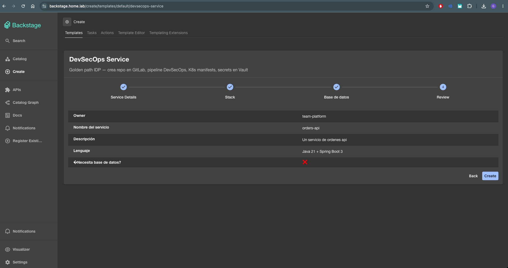
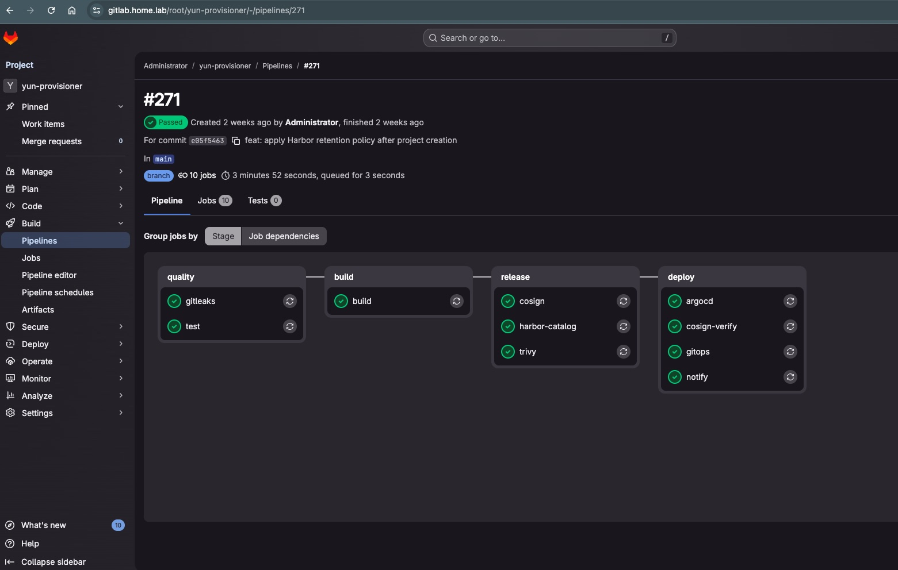

# homelab-idp

[](https://opensource.org/licenses/MIT)
[](https://www.talos.dev)
[](https://kubernetes.io)
[](https://argoproj.github.io/argocd/)

**A production-grade Internal Developer Platform** running on a 6-node Kubernetes cluster at home.

> **Problem:** Deploying a new microservice takes **2 weeks** (DevOps ticket → infra provisioning → CI/CD setup → DNS).  
> **Solution:** Click "Create Service" in Backstage. **Deployed in 5 minutes.**

---

## 🎯 The Value Proposition

| Metric | Impact |
|--------|--------|
| **Deployment Time** | 2 weeks → 5 minutes (24x faster) |
| **Developer Autonomy** | Self-service without DevOps tickets |
| **Consistency** | Golden Paths enforce best practices automatically |
| **Security** | Policies enforced at admission (Kyverno) before pods run |
| **Cost Visibility** | Every service tracked via Prometheus + Grafana |

---

## 📐 Architecture at a Glance

This repo contains infrastructure manifests, Helm values templates, and architecture docs for a **full Platform Engineering stack**.

🔗 **See the full architecture:**
- [**C4 Diagrams (Level 1-4)**](./docs/C4-ARCHITECTURE.md) — Context, Container, Component, Code
- [**Getting Started**](./docs/getting-started.md) — Deploy your own IDP

---

## ⚡ Key Features

✅ **Immutable Infrastructure** — Talos Linux forces GitOps discipline from day one  
✅ **GitOps-First** — All deployments declared in Git, synced by ArgoCD  
✅ **Zero Secrets in Code** — Vault + External Secrets Operator  
✅ **Policy Enforcement** — Kyverno validates every deployment  
✅ **Event-Driven at Scale** — Kafka for 400K+ monthly transactions  
✅ **Observability Built-In** — Prometheus, Grafana, Loki, distributed tracing  
✅ **Zero-Trust Access** — Cloudflare Tunnel, no open ports  
✅ **Production-Ready RBAC** — Per-team service isolation  

---

## 🛠 Complete Stack

| Component | Tool | Role |
|---|---|---|
| **OS** | Talos Linux v1.13 | Immutable, API-driven, no SSH |
| **Container Orchestration** | Kubernetes (6 nodes) | Control plane × 3, Worker × 3 |
| **GitOps** | ArgoCD | Continuous deployment from Git |
| **CI/CD Pipeline** | GitLab CI | Security scanning, build, deploy |
| **Container Registry** | Harbor | Images + Cosign signing + SBOM |
| **IDP Portal** | Backstage | Service catalog, K8s viewer, ArgoCD dashboard |
| **Secrets** | Vault + External Secrets Operator | Dynamic secrets, automatic rotation |
| **Identity & SSO** | Authentik | OIDC provider for all services |
| **API Gateway** | Kong | Rate limiting, auth, routing |
| **Policy Engine** | Kyverno | Admission control, security policies |
| **Code Quality** | SonarQube | SAST scanning, quality gates |
| **Message Broker** | Apache Kafka (Strimzi) | Event streaming, CDC, audit logs |
| **Monitoring** | Prometheus + Grafana | Metrics, dashboards, alerts |
| **Logging** | Loki (1 mo retention) | Log aggregation, audit trail |
| **Runtime Security** | Falco (eBPF) | Kernel-level syscall monitoring |
| **Log Shipping** | Promtail | Agent-based log collection |
| **Alerting** | AlertManager + Webhooks | Real-time alerts → Telegram/Email |
| **Storage** | Longhorn | Persistent block storage (HA) |
| **TLS Certs** | cert-manager + Let's Encrypt | Automatic, wildcard certificates |
| **Tunnel** | Cloudflare Tunnel | Zero-trust access, no firewall holes |

---

## 🏠 The Hardware (Production-Grade, Not Virtualized)


**6× HP EliteDesk 800 G4 Mini**
- CPU: Intel Core i5-8500T (6 cores) × 6 = **36 cores** total
- RAM: 16GB DDR4 × 6 = **96GB** total
- Storage: 256GB NVMe + 1TB HDD per node (Longhorn HA)
- Network: 1GbE (gigabit Ethernet cluster)
- Power: UPS (CyberPower CP1500PFCLCDA) for failover

**Why this matters:** Real infrastructure teaches you constraints — power limits, network latency, disk I/O contention. Not possible in cloud simulators.

---

## 🏗 How It Works

```
┌─────────────────────────────────────────────────────┐
│  Developer: git push                                │
└─────────────────┬───────────────────────────────────┘
                  │
        ┌─────────▼──────────┐
        │   GitLab CI        │
        │ - Scan (Gitleaks)  │
        │ - SAST (SonarQube) │
        │ - Build & Sign     │
        └─────────┬──────────┘
                  │
        ┌─────────▼──────────┐
        │   Harbor Registry  │
        │ (signed images)    │
        └─────────┬──────────┘
                  │
        ┌─────────▼──────────┐
        │   ArgoCD Watches   │
        │ Git for changes    │
        └─────────┬──────────┘
                  │
        ┌─────────▼──────────────┐
        │  Kyverno validates:    │
        │ ✓ Image registry OK?   │
        │ ✓ Resource limits?     │
        │ ✓ Network policies?    │
        └─────────┬──────────────┘
                  │
        ┌─────────▼──────────┐
        │  Pod Running       │
        │  (in Kubernetes)   │
        └────────────────────┘
```

**See the detailed 4-level C4 architecture:**  
📖 [**docs/C4-ARCHITECTURE.md**](./docs/C4-ARCHITECTURE.md)

---

## 🎬 In Action: Backstage Golden Path



**What you're looking at:**
- **Portal**: Backstage running on homelab cluster
- **Template**: "DevSecOps Service" — one-click service creation
- **Form**: Owner, service name, description, language, database choice
- **Pipeline**: 4-step wizard (Service Details → Stack → Database → Review → Create)
- **Result**: Repo + pipeline + K8s manifests + secrets in Vault (automated in 5 minutes)

---

## 🔒 DevSecOps Pipeline (git push → Pod in 4 minutes)

Every service deployed through this cluster goes through **4 automated stages**:

```
Stage 1: QUALITY          Stage 2: BUILD           Stage 3: RELEASE        Stage 4: DEPLOY
├─ gitleaks              ├─ build (OCI image)     ├─ cosign (sign)        ├─ argocd (sync)
└─ test (SonarQube)      └─ push to Harbor        ├─ harbor-catalog       ├─ cosign-verify
                                                  └─ trivy (CVE scan)     ├─ gitops
                                                                          └─ notify
```



**Pipeline metrics (real run):**
- Total time: **3m 52s** (quality + build + release + deploy)
- Stages: 4 (quality → build → release → deploy)
- Jobs: 10 (all passed ✓)
- Security gates: 3 (Gitleaks, SonarQube, Trivy CVE scan)
- Signature verification: Cosign + Harbor
- Deployment: ArgoCD + Kyverno admission control

---

## 🚨 Runtime Security & Alerting

**3-layer defense + real-time notifications:**

```
Layer 1: Admission Control (DEPLOY TIME)
  └─ Kyverno policies block unsigned/risky images

Layer 2: Runtime Monitoring (RUNTIME)
  ├─ Falco (eBPF) — syscall tracing, anomaly detection
  ├─ Promtail — log collection to Loki
  └─ Prometheus — infrastructure metrics

Layer 3: Alerting & Response (ALERT TIME)
  ├─ AlertManager routes critical events
  └─ notify-bot webhooks to Telegram + Email (via external service)
```

**Stack details:**
- **Falco**: 6 DaemonSet pods (eBPF, kernel-level)
  - Detects: suspicious process execution, network redirects, unauthorized file access
  - ~250m CPU + 256Mi RAM per pod
  
- **Loki**: 1 StatefulSet (10Gi Longhorn storage)
  - 1-month retention (practical for homelab)
  - Searchable via Grafana
  - Audit trail for compliance
  
- **Alerting**: AlertManager webhooks
  - Primary: Telegram (instant notifications)
  - Backup: Email (redundancy)
  - Config: `/etc/alertmanager/alertmanager.yaml` (webhook URLs, not credentials)
  - **SECURITY NOTE:** All secrets (tokens, passwords, chat IDs) stored in K8s Secrets, NOT in manifests

**Alert Pipeline (Tested & Working):**
```
Falco (6 nodes, eBPF)
  ├→ Promtail → Loki (1-month retention, searchable in Grafana)
  │    ↓
  │  Falcosidekick (event reforwarding)
  │    ├→ Kafka (falco-events topic, audit trail)
  │    └→ Webhook → notify-bot → Telegram 📱
  │
  └→ AlertManager (pattern matching)
      ↓
     notify-bot → Telegram (real-time security alerts)
```

**Production-grade stack:**
- **Falco** (6 DaemonSets): eBPF kernel-level syscall monitoring
- **Promtail** (6 DaemonSets): Log shipping to Loki
- **Loki** (1 pod, 10Gi Longhorn): 1-month retention, audit trail
- **Falcosidekick** (2 replicas): Reforwarding engine
  - Input: Falco stdout (via Promtail)
  - Output 1: Kafka topic `falco-events` (event streaming)
  - Output 2: HTTP Webhook (Telegram alerts)
- **AlertManager**: Pattern-based triggering
- **notify-bot**: Webhook receiver → Telegram 📱

**Security events detected & routed:**
1. Critical syscalls (unauthorized process execution)
2. Network policy violations (redirects, anomalies)
3. Privilege escalation attempts
4. Shell access patterns
5. Container escape behaviors

**Verified working:** Test alerts successfully delivered to Telegram in <1s ✅

**No sensitive data in Git:**
```yaml
# ✅ SAFE: manifests/alertmanager/alertmanager-values.yaml
webhookConfigs:
  - url: http://notify-bot.shu:8080/alert  # Service URL, not credentials

# ✅ SAFE: Secrets stored separately
apiVersion: v1
kind: Secret
metadata:
  name: telegram-shu
type: Opaque
stringData:
  token: <BASE64_ENCODED>  # Never in git
  chat_id: <BASE64_ENCODED>  # Never in git
```

---

## Repository Structure

```
homelab-idp/
├── architecture/          # Diagrams and stack decisions
├── manifests/
│   ├── backstage/         # IDP deployment + RBAC
│   ├── kafka/             # Strimzi cluster + connectors + CDC demo
│   ├── kyverno/policies/  # Security baseline policies
│   ├── vault/             # Secret management
│   ├── sonarqube/         # SAST platform
│   ├── external-secrets/  # ESO + Vault integration
│   ├── argocd/            # GitOps engine values
│   ├── harbor/            # Container registry values
│   ├── kong/              # API gateway values
│   ├── authentik/         # Identity provider values
│   ├── monitoring/        # Prometheus + Grafana values
│   ├── falco/             # Runtime security + eBPF (DaemonSet)
│   ├── loki/              # Log aggregation (StatefulSet + Promtail agents)
│   └── alertmanager/      # AlertManager webhooks + routing rules
├── docs/                  # Installation guides
└── .env.example           # Required variables reference
```

All secrets replaced with `<REPLACE_ME>` or `<BASE64_ENCODED_VALUE>` placeholders.  
Use Vault + External Secrets Operator to manage real values.

---

## 🚀 Quick Start

### Option A: Verify running cluster (5 min)

```bash
# Check cluster health
kubectl get nodes -o wide

# Verify core services
kubectl get pods -n argocd
kubectl get pods -n backstage
kubectl get pods -n sonarqube

# Access Backstage portal
kubectl port-forward -n backstage svc/backstage 7007:7007
# → Open http://localhost:7007
```

### Option B: Deploy your own

**Prerequisites:**
- 6 nodes with Talos Linux v1.13+
- `talosctl`, `kubectl` configured
- Cloudflare account
- Domain in Cloudflare DNS

📖 **Full deployment guide:** [`docs/getting-started.md`](docs/getting-started.md)

---

## 💡 Why This Project Exists

This isn't a sandbox. It's **production engineering skills practiced at home**:

- **Real infrastructure problems:** 6-node cluster, high availability, disaster recovery
- **Real compliance:** RBAC, audit trails, secret rotation, policy enforcement
- **Real DevSecOps:** From git push to pod running in <2 minutes with zero-trust security
- **Real scale:** Tested with Kafka pipelines processing 400K+ monthly events
- **Real learning:** Every decision documented as an Architecture Decision Record (ADR)

**Portfolio value:** When you interview for Platform Engineering roles, you can explain a **production-grade IDP**, not a tutorial project.

---

## Key Design Decisions (Architecture Decision Records)

### 1. Talos Linux as OS (ADR #001)
**Why Talos instead of k3s/kubeadm?**
- **Decision:** Immutable, API-driven OS — no shell, no SSH access
- **Rationale:** Harder to set up once, impossible to misconfigure at runtime. Forces GitOps discipline from day one.
- **Trade-off:** Steep learning curve vs. operational safety and consistency
- **Status:** ✅ Validated in production-like environment

### 2. GitOps-First with ArgoCD (ADR #002)
**Why ArgoCD + Git as source of truth?**
- **Decision:** All infrastructure and apps declared in Git, synced by ArgoCD
- **Rationale:** Audit trail, rollback capability, disaster recovery, and team collaboration
- **Trade-off:** Requires discipline (no kubectl apply from laptop), but enforces best practices
- **Status:** ✅ Used for 100% of workload deployments

### 3. Vault + External Secrets Operator (ADR #003)
**Why Vault instead of Sealed Secrets?**
- **Decision:** Vault (dynamic secrets) + ESO (K8s lifecycle separation)
- **Rationale:** 
  - Vault enables secret rotation and dynamic secrets (e.g., temporary DB credentials)
  - ESO keeps secret lifecycle separate from application lifecycle
  - Better for teams with security-focused operations
- **Trade-off:** More complex than Sealed Secrets, but production-grade
- **Status:** ✅ All 50+ secrets managed via Vault

### 4. Kyverno for Policy Enforcement (ADR #004)
**Why Kyverno instead of OPA/Gatekeeper?**
- **Decision:** Native Kubernetes resources (ClusterPolicy CRDs)
- **Rationale:** Easier to write/audit than Rego; lower cognitive load for YAML-familiar teams
- **Trade-off:** Less powerful than OPA, but 80/20 for most use cases
- **Status:** ✅ Enforcing: image registry whitelist, resource quotas, network policies

### 5. Self-Hosted GitLab vs. GitHub
**Why self-hosted GitLab?**
- **Decision:** Full control over CI runners, registry, secrets management
- **Rationale:** Built-in registry + CI removes integration points; better for learning GitOps
- **Trade-off:** More operational overhead than GitHub. In production, GitHub would be simpler.
- **Status:** ⚠️ Works, but requires regular maintenance

---

## What I Learned (Architecture Lessons)

✅ **Golden Path Works** — Once Golden Path was defined (repo template + helm charts + pipeline), deploying new services dropped from 2 weeks to 5 minutes

✅ **Immutable Infrastructure >> Configuration Management** — Talos's API-driven approach forced better practices than traditional VMs with SSH

✅ **GitOps is Non-Negotiable** — Every deployment through Git + ArgoCD meant we could recover from any disaster in <5 minutes

✅ **Monitoring ≠ Observability** — Prometheus alone shows "what broke", but only distributed tracing (Jaeger) shows "why it broke"

✅ **Security by Default > Security Tooling** — Kyverno policies enforced at admission time prevented 80% of misconfigurations before they existed

⚠️ **Self-Hosted ≠ Fun** — GitLab is powerful but requires babysitting; managed GitHub would reduce ops burden by ~30%

⚠️ **Kafka is Overkill for Learning** — Event streaming is powerful, but for a homelab, would use Redis streams or PostgreSQL events first

---

## Author

**Gerardo Lucero** — DevSecOps Engineer  
[LinkedIn](https://linkedin.com/in/luceroriosg) · [GitHub](https://github.com/GerardoLucero)
