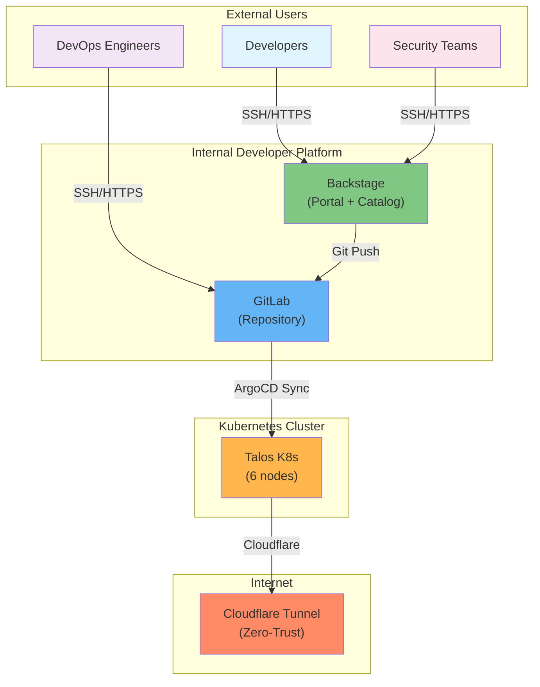
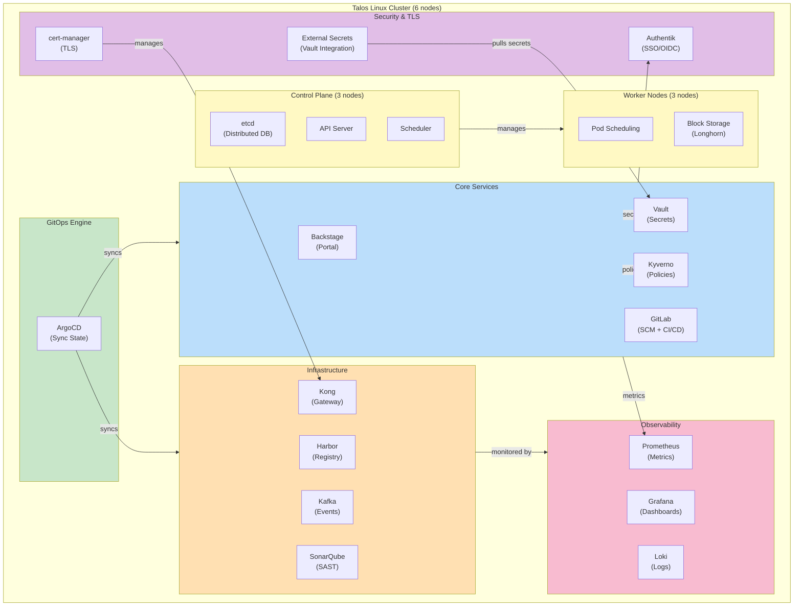
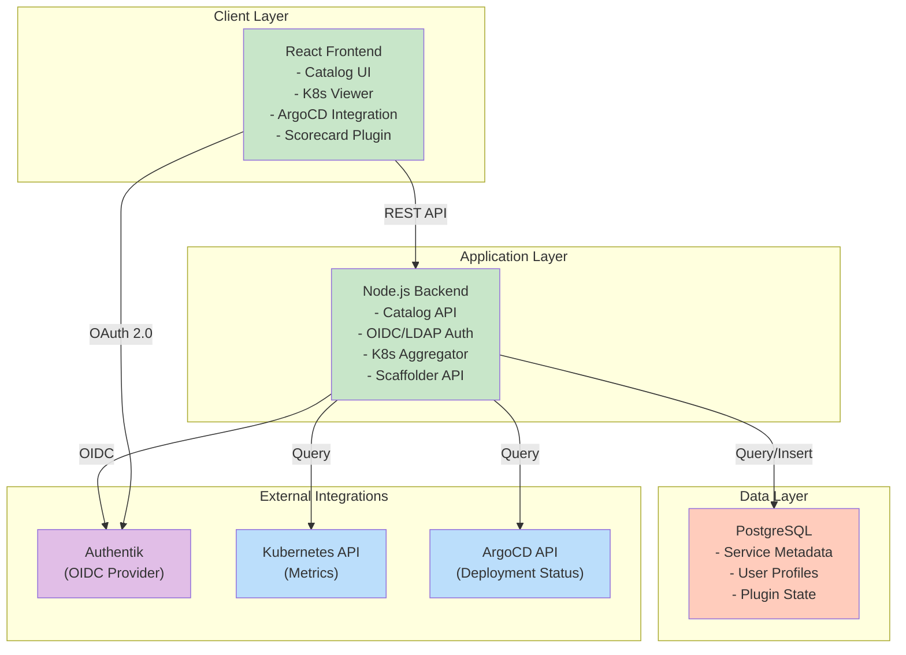
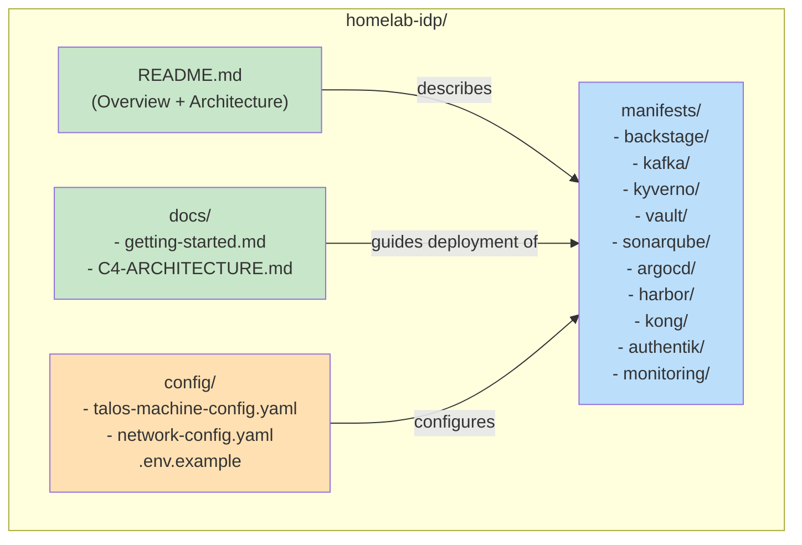
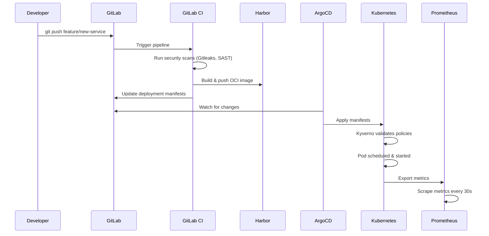
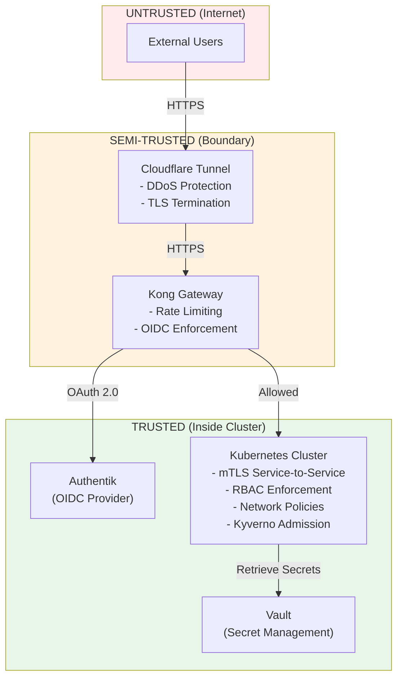

# C4 Architecture — homelab-idp

This document describes the system architecture at 4 levels of detail: Context, Container, Component, and Code.

---

## Level 1: System Context

**What problem does this solve?**

A developer needs to deploy a microservice. Today:
- Call DevOps team (wait 3 days)
- Request infra ticket (wait 2 days)  
- Request CI/CD setup (wait 2 days)
- Request DNS + certs (wait 1 day)
- **Total: ~1-2 weeks before writing code**

**With this IDP:**
- Click "Create Service" in Backstage (1 minute)
- [Automated] repo created, pipeline configured, infrastructure provisioned, DNS set up
- **Total: 5 minutes, developer can start coding immediately**

---

## Level 2: Container (Major System Components)

The entire system runs within a single Kubernetes cluster on Talos Linux.

---

## Level 3: Component (Key Container Internals)

### 3a. Backstage (IDP Portal)

### 3b. DevSecOps Pipeline (git push → deployment)

```mermaid
graph LR
    DEV["Developer<br/>git push"] -->|triggers| GITLAB["GitLab CI"]
    
    GITLAB -->|Stage 1| SCAN["Security Scanning<br/>- Gitleaks<br/>- SonarQube<br/>- Trivy<br/>- Cosign Sign"]
    
    SCAN -->|Stage 2| BUILD["Build & Registry<br/>- Build OCI Image<br/>- Push to Harbor<br/>- Generate SBOM"]
    
    BUILD -->|Stage 3| VERIFY["Verify & Comply<br/>- Image Signature<br/>- Supply Chain Checks<br/>- Audit Log"]
    
    VERIFY -->|Stage 4| GITOPS["GitOps Sync<br/>- Update Manifests<br/>- Push to Git"]
    
    GITOPS -->|triggers| ARGOCD["ArgoCD Watches<br/>- Detects Changes<br/>- Applies to K8s"]
    
    ARGOCD -->|validates| KYVERNO["Kyverno Policies<br/>- Image Registry OK?<br/>- Resource Quotas?<br/>- Network Policies?"]
    
    KYVERNO -->|deploys| POD["Pod Running<br/>- Prometheus Scrape<br/>- Grafana Monitor<br/>- Kong Route"]
    
    style DEV fill:#e3f2fd
    style GITLAB fill:#fff9c4
    style SCAN fill:#ffe0b2
    style BUILD fill:#ffe0b2
    style VERIFY fill:#f8bbd0
    style GITOPS fill:#c8e6c9
    style ARGOCD fill:#c8e6c9
    style KYVERNO fill:#c8e6c9
    style POD fill:#bbdefb
```

---

## Level 4: Code (Specifics)

Key directories in this repository:

---

## Data Flow Summary

---

## Security Boundaries

---

## Key Design Decisions (ADRs)

### ADR #001: Talos Linux as OS
- **Decision:** Immutable, API-driven OS — no shell, no SSH
- **Rationale:** Impossible to misconfigure at runtime; forces GitOps discipline
- **Trade-off:** Steep learning curve vs. operational safety

### ADR #002: ArgoCD + Git as Source of Truth
- **Decision:** All infrastructure declared in Git, synced by ArgoCD
- **Rationale:** Audit trail, rollback capability, disaster recovery
- **Trade-off:** No kubectl apply from laptop; enforces best practices

### ADR #003: Vault + External Secrets Operator
- **Decision:** Dynamic secrets + K8s lifecycle separation
- **Rationale:** Secret rotation, temporary credentials, better than Sealed Secrets
- **Trade-off:** More complex setup, but production-grade

### ADR #004: Kyverno for Policy Enforcement
- **Decision:** Native Kubernetes CRDs instead of OPA/Gatekeeper
- **Rationale:** Easier to write/audit than Rego; lower cognitive load
- **Trade-off:** Less powerful than OPA, but 80/20 for most cases

---

## What I Learned

✅ **Golden Path Works** — Once defined, deployment time: 2 weeks → 5 minutes

✅ **Immutable Infrastructure >> Config Management** — Talos forced better practices

✅ **GitOps is Non-Negotiable** — Can recover from any disaster in <5 minutes

✅ **Monitoring ≠ Observability** — Prometheus shows "what broke", tracing shows "why"

✅ **Security by Default** — Kyverno policies caught 80% of misconfigurations before they existed

⚠️ **Self-Hosted ≠ Fun** — GitLab requires babysitting; managed GitHub would reduce ops by ~30%

⚠️ **Kafka is Overkill for Learning** — Event streaming is powerful, but Redis streams are simpler first

---

## Next Steps

- For deployment: see [docs/getting-started.md](./getting-started.md)
- For infrastructure code: see [../manifests/](../manifests/)
- For GitOps workflow: see [docs/gitops-workflow.md](./gitops-workflow.md) (coming soon)
